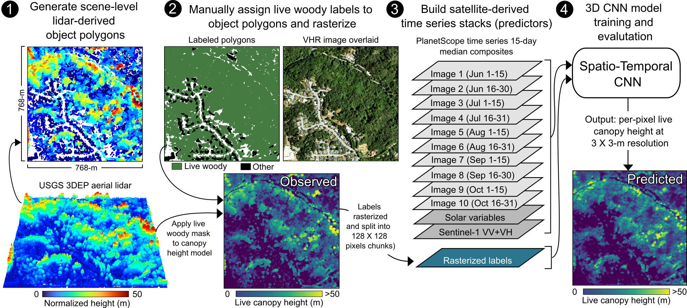

# canopy-height-CA

Last updated: 12.2024

Overview
--------

This repository is associated with the article "Canopy height estimation from PlanetScope time series with spatio-temporal deep learning
" in the journal *Remote Sensing of Environment* by Dan J. Dixon, Yunzhe Zhu and Yufang Jin (2025). 

Visualize the predicted model outputs for the Sierra Nevada in 2022 in this [Google Earth Engine supported web application](https://ca-forest-structure.projects.earthengine.app/view/canopy-height)

Graphical abstract:

  

Included are the ST-CNN Python code (model/st-cnn_height_s1True_topoTrue.zip) and saved TensorFlow model (model/st-cnn_height_s1True_topoTrue.zip). 

You can find model training labels, testing labels and testing predictions in the data repository on the Open Science Framework repository (https://osf.io/7xz28/wiki/home/).

Also included are the train/test locations in the folder "data". 